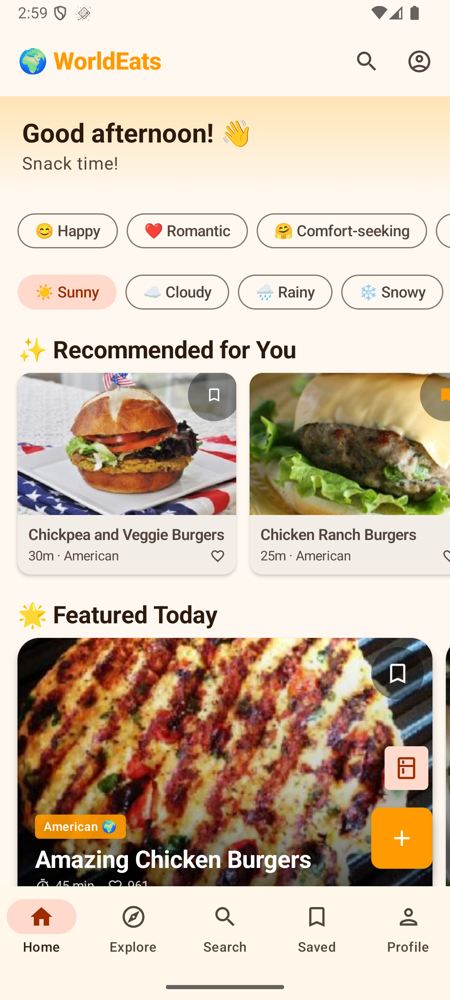

# WorldEats_Public
<a href="https://edenchisvo.github.io/WorldEats_Public/PrivacyPolicy.md">Privacy Policy</a> <strong>|</strong>
<a href="https://edenchisvo.github.io/WorldEats_Public/TermsOfService.md">Terms Of Service</a> <strong>|</strong>
<a href="https://edenchisvo.github.io/WorldEats_Public/DataDeletion.md">Data Deletion Process</a>
<!DOCTYPE html>
<html lang="en">
<head>
    <meta charset="UTF-8">
    <meta name="viewport" content="width=device-width, initial-scale=1.0">
    <title>WorldEats | Every Cuisine. Every Culture.</title>
    <link rel="preconnect" href="https://fonts.googleapis.com">
    <link rel="preconnect" href="https://fonts.gstatic.com" crossorigin>
    <link href="https://fonts.googleapis.com/css2?family=Outfit:wght@300;400;600;700&display=swap" rel="stylesheet">
    
</head>
<body>

    <header>
        

            
WorldEats

            
Every Cuisine. Every Culture. Right in your pocket.

            <a href="#" class="btn">Available on Google Play</a>

            

                <!-- Replace with an actual screenshot later -->
                
            

        

    </header>

    <section class="container">
        <h2 style="text-align: center; margin-bottom: 50px;">Why WorldEats?</h2>
        

            

                
🔍

                <h3>AI Pantry Scanner</h3>
                
Don't know what to cook? Snap a photo of your ingredients and let our AI suggest the perfect global recipe.

            

            

                
🎙️

                <h3>Hands-Free Cooking</h3>
                
Messy hands? No problem. Use voice commands to navigate steps, repeat instructions, or set timers without touching your screen.

            

            

                
🌍

                <h3>Global Flavors</h3>
                
Explore thousands of authentic recipes from every corner of the world. Filter by diet, mood, or occasion.

            

        

    </section>

    

        

            <a href="https://edenchisvo.github.io/WorldEats_Public/PrivacyPolicy.md">Privacy Policy</a>
            <a href="https://edenchisvo.github.io/WorldEats_Public/TermsOfService.md">Terms of Service</a>
            <a href="https://edenchisvo.github.io/WorldEats_Public/DataDeletion.md">Data Deletion</a>
        

    

    <footer>
        

            
&copy; 2023 WorldEats. All rights reserved.

            
Designed for foodies, by foodies.

        

    </footer>

</body>
</html>
